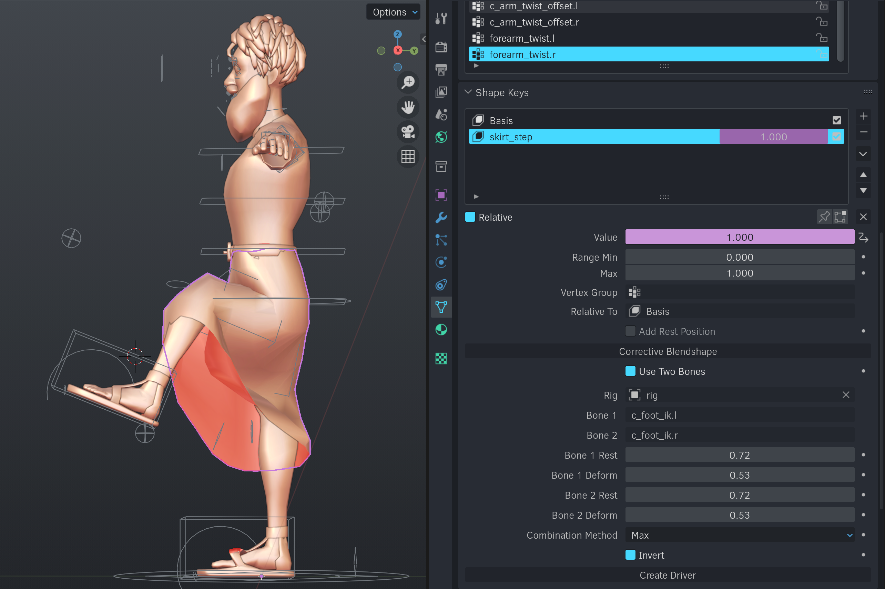
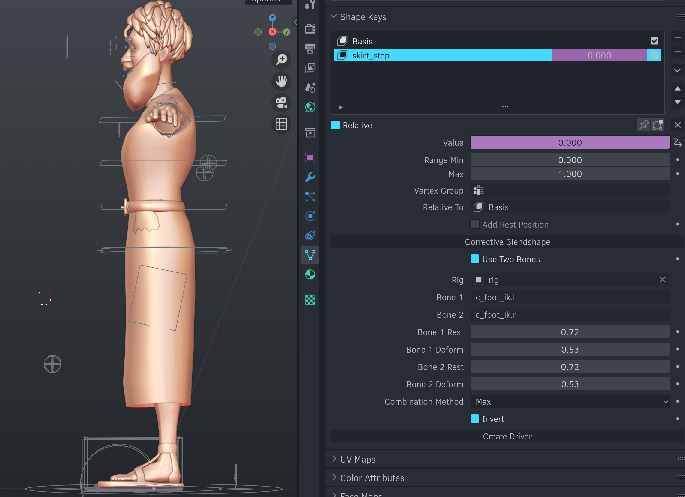
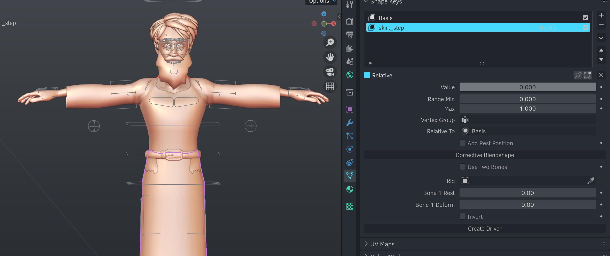
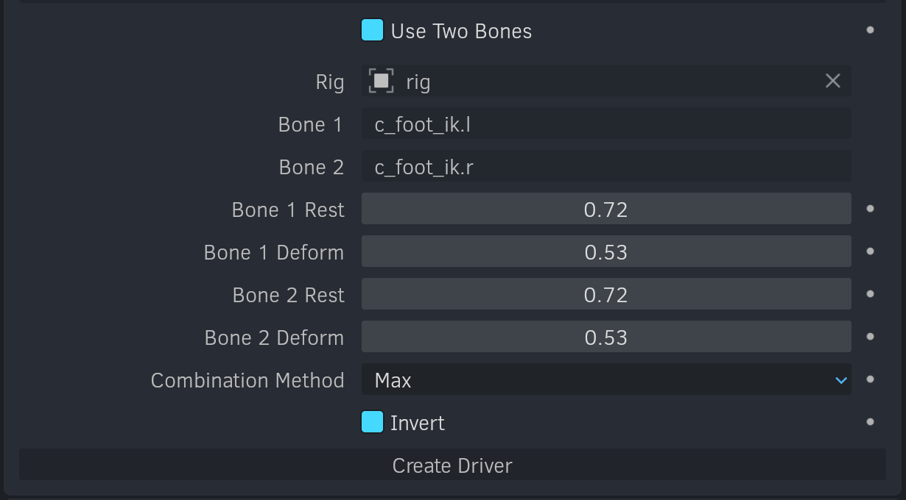

# quick_corrective_blendshapes
 
## Description
Quick Corrective Blendshapes is a Blender add-on designed to make driving shapekeys from bones faster. It specifically is designed to solve problems like a skirt deform when a leg is raised- it uses bone distance from the root bone as a crude, but effective, measure of how much a shapekey should be applied. You can see what this does below: 

Here, the shapekey value is 1. 

Here, the shapekey value is 0. The only change is that the foot controller has been moved- the shapekey is driven by the distance between the foot controller and the root bone.

## Basic Usage
1. Install the add-on (if you're using Blender 4.0 or higher, you'll need to install it as a "legacy add-on")
2. Select the rigged mesh you want to apply the shapekeys to
3. Create a base shapekey and any other desired corrective shapekeys

## Detailed Usage
When you reach this point, you'll see a "Corrective Blendshape" button in the Shape Key panel of the Properties Editor. (It's called "blendshape" because I made this for my coworkers who are used to Maya.) Click this button to begin.

You'll now see the following:

In this example, I'll be using a shapekey that corrects a skirt when either leg is raised. It's named "skirt_step", and I'd like it to be set to 1.0 when either leg is raised.

1. Select the rig you want to use to drive the shapekey. 

Since I'm using either leg as a driver, I will turn on "Use Two Bones".

3. Type the name of bone that you want to drive the shapekey in the "Bone Name 1" field. For this example, I'll use "c_foot_ik.l". If you are using two bones, type the name of the second bone in the "Bone Name 2" field. For this example, I'll use "c_foot_ik.r".
4. Set the following fields. Don't worry if they're not perfect, you can adjust them and regenerate the driver any number of times.

- Bone 1 Rest: The distance from the root bone to the driver bone when the driver bone is at rest. For me, it's about .72. 
- Bone 2 Rest: The distance from the root bone to the second driver bone when the second driver bone is at rest. For me, it's about .72, the same as the first bone.
- Bone 1 Deform: The distance from the root bone to the driver bone when the driver bone is at its maximum deformation. For me, it's about .53.
- Bone 2 Deform: The distance from the root bone to the second driver bone when the second driver bone is at its maximum deformation. For me, it's about .53, the same as the first bone.
- Combination Method: There are three combination methods; Max, Min, and Average. For my case, I'll use Max. Max means that the shapekey will increase value if either bone moves toward the deformation distance. This works well for cases where you want the shapekey to be applied if either bone is deformed- like a skirt that should deform if either leg is raised. Average is a simple average of the two bones. 
- Invert: This determines whether the shapekey will be at 0 when the bone is at rest or at 1 when the bone is at rest. If your rest is larger than your deform, you'll probably want this on. In my case, I'll turn it on.

5. Click "Create Driver". Your shapekey value is now purple, meaning the driver has been created. Test your poses- if the shapekey values are wrong, adjust the distances and click "Create Driver" again. When you click "Create Driver", the previous driver will be deleted and replaced with the new one.